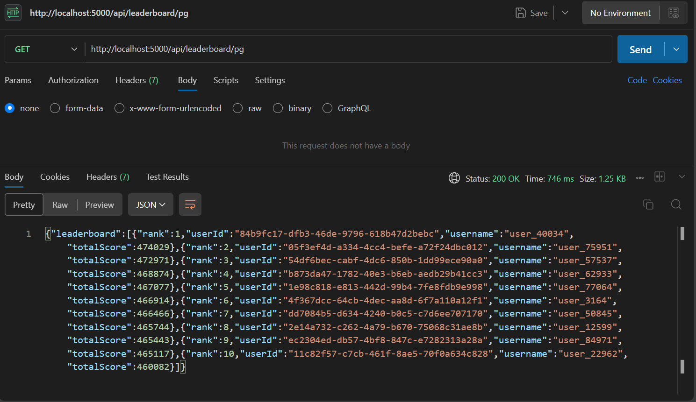
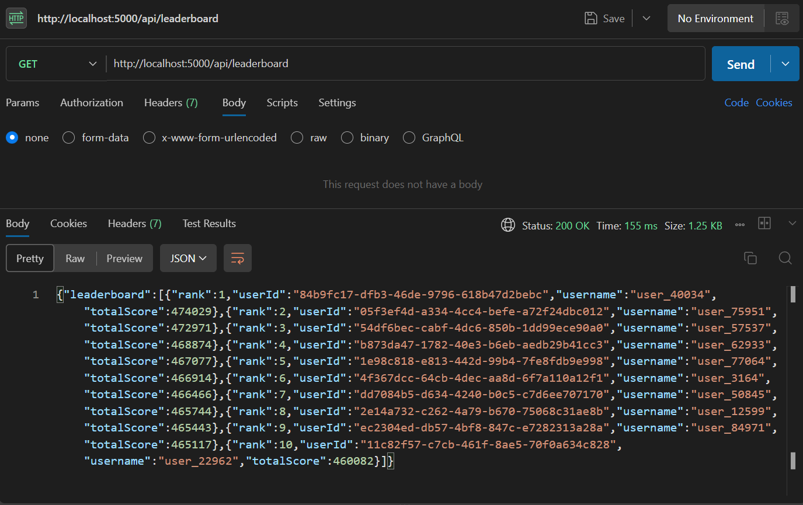

## Real-Time Leaderboard System, using Raw websockets and Redis Sorted Sets 

A scalable real-time leaderboard system built with **PostgreSQL**, **Redis Sorted Sets**, raw **WebSockets**, **Node.js**, and **TypeScript**.

The system allows users to submit scores, calculates global rankings, provides player-specific rank lookup, and pushes leaderboard updates to connected clients in real time.

This project was built primarily to explore performance bottlenecks, database vs. in-memory ranking, real-time communication, and scalable backend architecture.

---
## Results of load test (kept at the starting coz of the reduced attention span of this generation):
### Observed latencies for Fetching leaderbaord and rank of user using raw Postgresql and using Redis:
#### Rank Fetch Benchmark — 10K Requests.

| Metric | Redis | PostgreSQL |
|---|---:|---:|
| Total Users | 100,000 | 100,000 |
| Total Requests | 10,000 | 10,000 |
| Concurrency | 100 | 100 |
| Successful Requests | 10,000 | 10,000 |
| Failed Requests | 0 | 0 |
| Total Time | 53.93 s | 172.40 s |
| Throughput | 185.43 req/s | 58.00 req/s |
| Average Latency | 537.40 ms | 1715.36 ms |
| P95 Latency | 951.36 ms | 2226.79 ms |
| P99 Latency | 1367.15 ms | 2575.72 ms |

### Leaderboard Fetch Bnechmark - 1K Requests
ps: higher no of requests for the raw postgresql benchmark was making the test crash as it was using more cpu than allotted(im using supabase free trial so thats why).
| Metric | Redis Top Players | Raw PostgreSQL |
|---|---:|---:|
| URL | `/api/leaderboard` | `/api/leaderboard/pg` |
| Total Requests | 1,000 | 1,000 |
| Concurrency | 50 | 50 |
| Successful | 1,000 | 1,000 |
| Failed | 0 | 0 |
| Total Time (ms) | 17,236.60 | 406,695.44 |
| Throughput (req/s) | 58.02 | 2.46 |
| Min Latency (ms) | 710.21 | 4,618.71 |
| Average Latency (ms) | 840.45 | 19,940.42 |
| p50 Latency (ms) | 765.94 | 19,714.47 |
| p95 Latency (ms) | 1,055.24 | 22,880.31 |
| p99 Latency (ms) | 1,696.23 | 23,262.22 |
| Max Latency (ms) | 1,900.54 | 23,414.82 |

so this means that  **Redis** reduced p50 latency from **19.71s to 0.77s (~96% lower)** and increased throughput from **2.46 req/s to 58.02 req/s (~23.6× higher)** for Top-N player fetching.

And for player rank fetching **Redis** reduced average latency from **1.72s to 0.54s (~68% lower)** and increased throughput from **58.00 req/s to 185.43 req/s (~3.2× higher)** compared to PostgreSQL.

---

## What the project is basically?

A leaderboard ranks players based on their scores.

For example:

| Rank | Player   | Score  |
|------|----------|--------|
| 1    | Player A | 98,500 |
| 2    | Player B | 94,200 |
| 3    | Player C | 91,750 |
| 4    | Player D | 87,300 |

In a real application, a leaderboard could contain thousands or millions of players, while users continuously submit new scores.
The challenge isn't simply storing scores — it's efficiently answering questions like:

- Who are the top 10 players?
- What is my current rank?
- What is my total score?
- What happens when thousands of scores are updated at once?
- How can connected clients see leaderboard changes immediately?

This project explores those problems.

##  Use Cases

A real-time leaderboard can be used in any system where users compete based on scores or points like :

- Games
- Competetive platforms like leetcode contests
- Fitness Apps, Education Platforms etc.
Any service where a realtime leaderboard is useful this project comes in place.

```
Player/User → submits score → leaderboard updates → connected players/Users receive update
```


## Why Redis Sorted Sets?

Initially the project used postgresql and nodejs to calculate the top players or players rank. This operation was very expensive and memory exhausting when i tested it for 
10000 requests at concurrency 100 for about 100000 user entries and 500000 scores entries. This led to my computers memory overflow for nodejs so i switched to raw
postgresql implementation.

The implementation used PostgreSQL to calculate the leaderboard:

```
PostgreSQL → Fetch users → Fetch scores → Calculate total scores → Sort users → Return top 10
```

This also becomes expensive as the number of users and scores grows. On the test dataset, the raw PostgreSQL implementation took approximately **~ 800** to fetch the top 10 players.
Then Redis Sorted Sets was implemeted to optimise this. 

```
leaderboard:global

user_101 → 95000
user_205 → 91000
user_301 → 87000
user_402 → 82000
```

Under the same test conditions, the Redis implementation took approximately **~100 ms**, which is almost 88% increase in efficiency.

## PostgreSQL vs Redis Performnce results

**PostgreSQL** — `GET /api/leaderboard/pg`

```
JOIN → SUM() → GROUP BY → ORDER BY → LIMIT 10
```

**Redis Sorted Set** — `GET /api/leaderboard`


Ranking is performed directly using the Sorted Set structure.

##  System Architecture

PostgreSQL remains the **persistent source of truth**, Redis Sorted Sets act as a **specialized high-performance ranking layer**, and WebSockets provide the **real-time delivery mechanism** to connected clients.

```
                    ┌─────────────────┐   ┌─────────────────┐   ┌─────────────────┐
                    │     Client 1    │   │     Client 2    │   │     Client 3    │
                    └────────┬────────┘   └────────┬────────┘   └────────┬────────┘
                             │                     │                     │
                             └────────────WebSocket┴─────────────────────┘
                                                     │
                                          ┌──────────▼──────────┐
                                          │   Node.js / Express │
                                          │    WebSocket Server │
                                          └──────────┬──────────┘
                                                     │
                              ┌──────────────────────┴──────────────────────┐
                              │                                             │
                    ┌───────── ▼ ─────────┐                      ┌───────── ▼ ─────────┐
                    │     Redis ZSET      │                      │     PostgreSQL      │
                    │  Fast Ranking       │                      │ Persistent Source of│
                    │        Layer        │                      │        Truth        │
                    └─────────────────────┘                      └─────────────────────┘
```

- **PostgreSQL** → Persistent Source of Truth
- **Redis ZSET** → Fast Ranking Layer
- **WebSocket** → Real-Time Update Layer

##  How the System Works

There are two major flows.

##  Real-Time WebSocket Communication

Instead of clients continuously polling:

```
Client → GET leaderboard
Client → GET leaderboard
Client → GET leaderboard   (repeated, wasteful)
```

the system uses a persistent WebSocket connection. Multiple clients can stay connected simultaneously:

```
Client 1 ─────┐
Client 2 ─────┤
Client 3 ─────┼──→ WebSocket Server
Client 4 ─────┤
Client 5 ─────┘
```

When the leaderboard changes:

```
Score Updated → Redis updated → Server fetches Top N → Broadcast → All connected clients
```

Clients never have to repeatedly request the leaderboard — updates arrive as they happen.

---

##  API Endpoints

This project intentionally ships **two** leaderboard implementations side by side, for comparison.

### Redis Leaderboard

**Get Top Players**

```
GET /api/leaderboard
```

Uses a Redis Sorted Set to retrieve the top 10 players.

```json
{
  "leaderboard": [
    {
      "rank": 1,
      "userId": "user123",
      "username": "player1",
      "totalScore": 98500
    }
  ]
}
```

**Get Player Rank**

```
GET /api/leaderboard/:userId
```

Uses Redis `ZREVRANK` to determine the player's position.

###  Raw PostgreSQL Leaderboard

Exists primarily for performance comparison and experimentation.

**Get Top Players**

```
GET /api/leaderboard/pg
```

Aggregates and sorts directly in the database:

```sql
SUM(score)
GROUP BY user
ORDER BY totalScore DESC
LIMIT 10
```

**Get Player Rank**

```
GET /api/leaderboard/pg/:userId
```

Calculates rank using a window function:

```sql
RANK() OVER (
    ORDER BY totalScore DESC
)
```

This gives a direct comparison between database-side ranking and Redis Sorted Set ranking.
##  API Testing
Response times were first sanity-checked with Postman:

For fetching Leaderboard:
| Endpoint                  | Response Time|
|---------------------------|--------------|
| `GET /api/leaderboard/pg` | ~800 ms      |
| `GET /api/leaderboard`    | ~100 ms      |

For fetching rank of a Player:
| Endpoint                        | Response Time|
|---------------------------------|--------------|
|`GET /api/leaderboard/:userid`   |   900ms      |
|`GET /api/leaderboard/pg/:userid`|   150ms      |


##
